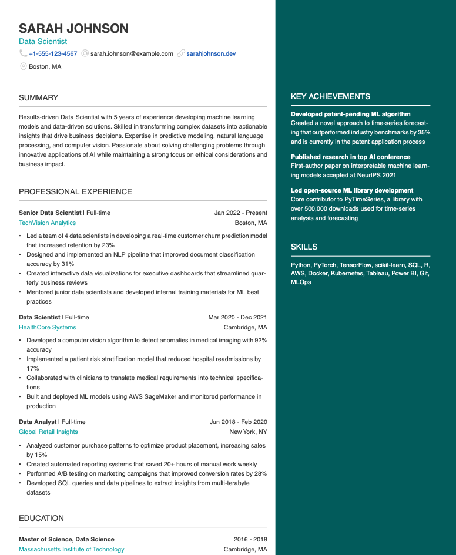

# Resume Builder

I wanted to have a nice resume in pdf format. Current document editor (Google Docs, Pages, MS Word) fail to produce a layout that I wanted. Often editor specific margins/spacing get in the way and some layout just outright impossible without unwanted negative space leaking in.

So I resorted to creating layout in React and export to pdf with [react-pdf](https://react-pdf.org). Output pdf is only 8-10 kb, which is surprising. Pdf is also vectorised so zoomng in will not result in any loss in quality.

Following is the one and only design at the moment.

# How to customise with your own data

1. Edit json file in `data.js`
2. `npm run dev` (make sure to run `npm install` first)
3. Visit localhost and download the pdf
